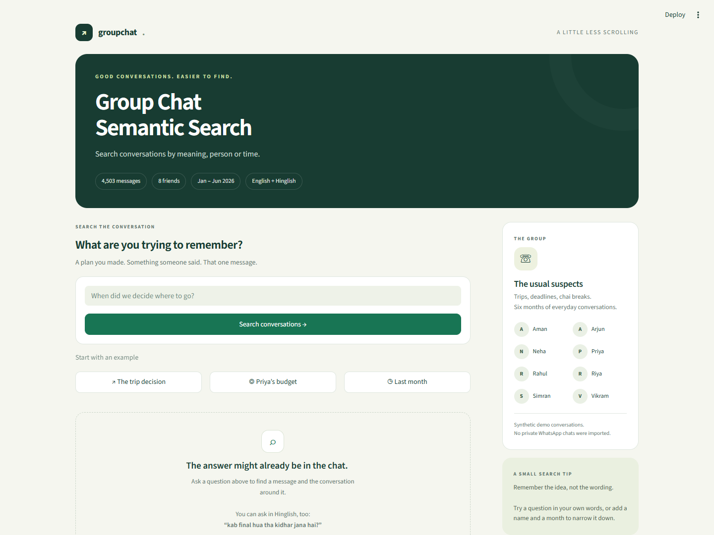

# Group Chat Semantic Search

A small local Streamlit project for searching a synthetic WhatsApp-style group by meaning, person, or time.



The interface includes a responsive search layout, one-click examples, participant details, detected-filter labels, and highlighted chat excerpts. All styling is local; no external fonts or image services are required.

## Problem
Exact keyword search misses conversations written in Hinglish, abbreviated English, and mixed languages. A question about a holiday decision may refer to a message saying "Manali locked".

## Approach
Generate six calendar months of chat for exactly eight participants, including three long decision threads. Embed **only message text** with `sentence-transformers/paraphrase-multilingual-MiniLM-L12-v2`. Normalize vectors and store them locally. Filter by sender/date when recognized, remove that metadata and common question framing from the query, then rank by cosine similarity. Ordinary semantic queries are embedded unchanged. Collapse identical result texts so repeated replies cannot fill all five slots. Show two chronological messages before and after each match, including other senders.

No LLM query parser, agent framework, database, or remote vector service is used.

## Architecture
User Query → Query Parsing → Person / Time Filtering → Query Cleanup → Multilingual Embedding → Cosine Similarity → Distinct Top-K Messages → Conversation Context

- `generate_chat.py`: seeded conversations, CSV, marked targets, test-set output.
- `query_set.py`: 40 manually authored queries; never read by search.
- `build_index.py`: embeddings and a small manifest linking rows to message IDs.
- `search.py`: `search_chat(query, top_k=5)`, regex filters, ranking and context.
- `evaluate.py`: exact target rank and aggregate Top-1/Top-5 results.
- `app.py`: one-page search UI with clickable examples, persistent results, detected filters and highlighted matches.
- `assets/style.css`: responsive layout and conversation-card styling.
- `.streamlit/config.toml`: a simple green theme.
- `data/`: chat CSV, target IDs, 40 queries, embeddings and index manifest.
- `results/evaluation.json`: measured results and retrieved IDs/scores for every query.

## Setup
Use Python 3.11 or newer. From this directory:

```bash
python -m venv .venv
# Windows PowerShell:
.\.venv\Scripts\Activate.ps1
# macOS/Linux: source .venv/bin/activate
pip install -r requirements.txt
```

The first index build downloads the multilingual model from Hugging Face. Allow several minutes and sufficient disk space for Python dependencies and model weights. Later runs reuse the project-local .model_cache folder (excluded from version control). No API key is needed.

## Running
```bash
python generate_chat.py
python build_index.py
streamlit run app.py
```

The generator is deterministic. Rebuild the index and restart the app after changing the CSV; a checksum rejects stale indexes.

Try:
- When did we decide where to go?
- What did Priya say about our budget?
- kab final hua tha kidhar jana hai?
- rehne ka kya final hua?
- What did we discuss last month?

Dates are anchored to the **latest chat date: June 30, 2026**, not the computer clock. Today/yesterday are whole days; last week is the previous Monday–Sunday; last month is the previous calendar month; this month is June. Full month names are supported, optionally followed by a year. Without a year, the latest matching month at or before the reference month is used. Matching is case-insensitive. A recognized name filters to that sender; sender and date filters can be combined. Context remains unfiltered. There may be fewer than two neighboring messages at the chat boundaries.

## Evaluation
```bash
python evaluate.py
```

Exactly 40 queries: 22 semantic, 10 person, 8 time. Eight semantic queries have zero overlapping word tokens with their labeled target, checked at evaluation time. The three decision targets are explicitly marked in `data/targets.json`. Additional queries cover everyday facts and Hinglish. The script prints and saves actual Top-1/Top-5 hit counts, accuracy, category breakdowns, target ranks, and retrieved IDs/scores. See `results/evaluation.json` for the measured run.

Top-5 accuracy means the single labeled message ID occurs among the five returned messages. Identical texts share one slot; the best-scoring occurrence is shown (earliest in the chat for exact ties), with a count of matching occurrences. No target IDs, labels, or handcrafted decision boosts participate in search. The original measured run is preserved in `results/baseline_evaluation.json`.

Measured locally with the required model on 4,503 messages:

| Query set | Top-1 | Top-5 |
| --- | --- | --- |
| All 40 | 18/40 (45.0%) | 26/40 (65.0%) |
| Eight zero-word-overlap queries | 1/8 (12.5%) | 3/8 (37.5%) |

Compared with the original run, overall Top-5 improved from 55.0% to 65.0%, and zero-overlap Top-5 improved from 25.0% to 37.5%. Overall Top-1 decreased from 47.5% to 45.0%: more targets appear in the shortlist, but the first result is not uniformly better. These are development comparisons on the same unchanged 40 queries, not a new held-out benchmark.

The Hinglish question "kab final hua tha kidhar jana hai?" retrieves the destination decision at rank 1. The English question "When did we decide where to go?" misses it in the Top 5. These results show a real limitation of this model on Romanized Hindi; semantic similarity alone does not reliably recover every decision. The labels and queries were fixed before running evaluation.

## Limitations
Semantic embeddings can confuse similar discussions, short messages, ambiguous pronouns, and repeated topics. Romanized Hindi is less reliable than well-formed text. This fixed test set is a small demonstration, not a general benchmark; several queries share targets. Generic time questions have multiple reasonable answers, but evaluation checks only one labeled ID. Repeated casual templates make the synthetic data less varied than real chats.

Only simple name/date expressions are understood; multiple names select the first participant match. Query cleanup uses a few regex rules and can remove useful wording. Identical messages at different times may have different meanings; collapsing them shows only one occurrence. Context is displayed after retrieval and is not embedded. Similarity is not a confidence percentage. A date with no messages returns no results. This project does not infer an answer or summarize an entire month.
